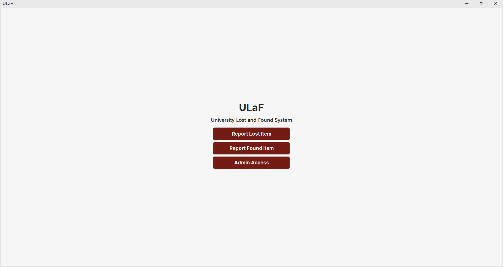
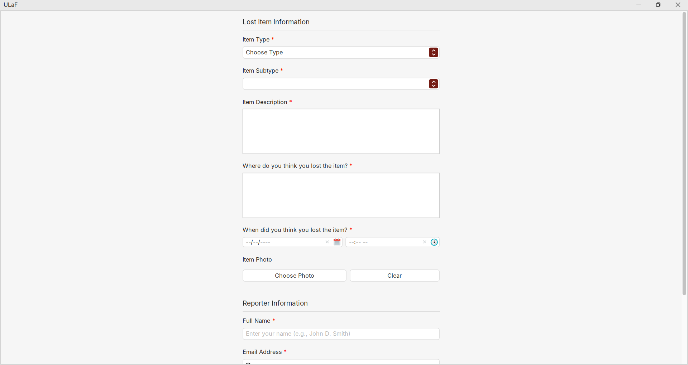
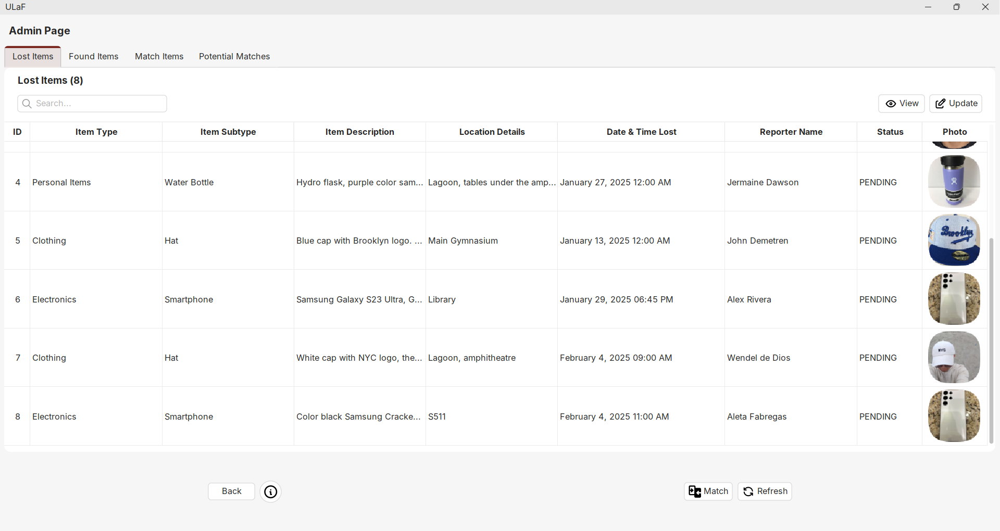
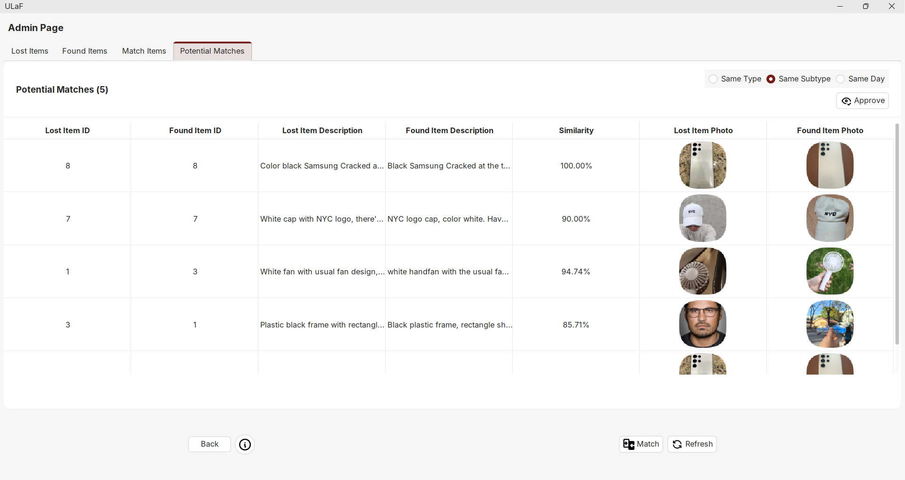
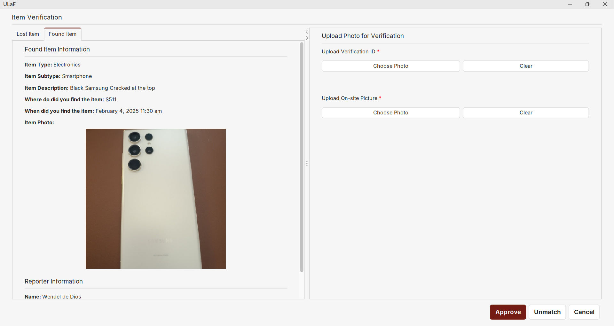

# ULaF: University Lost and Found

The University Lost and Found (ULaF) system is designed to help students and staff report and recover lost items on campus. This system allows users to:

- Report lost items with detailed descriptions and contact information.
- Search for found items that have been reported by others.
- Manage and update the status of reported items.

The goal of ULaF is to streamline the process of recovering lost items and ensure that they are returned to their rightful owners as quickly as possible.

## 📸 Screenshots







## 👥 Group Members

- John Paul Viado
- Wendel de Dios

## 🚀 Getting Started

### Prerequisites

Before you begin, ensure you have the following installed:

- **Java Development Kit (JDK)** (version 8 or higher) [Download JDK](https://www.oracle.com/java/technologies/downloads/#jdk23-windows)
- **Maven** (for building the application) [Download Maven](https://maven.apache.org/download.cgi?.)
- **MySQL** (for the database) [Download MySQL](https://dev.mysql.com/downloads/installer/)
- **Git** (to clone the repository) [Download Git](https://git-scm.com/downloads)

---

### 1. Clone the Repository

Clone the repository to your local machine:

```bash
git clone https://github.com/Viadsss/LostFoundSystem.git
cd your-repository
```

---

### 2. Set Up Environment Variables

Before running the application, **copy** the `.env_example` file to `.env`:

- **Linux/macOS (Bash)**:

  ```bash
  cp .env_example .env
  ```

- **Windows (CMD)**:

  ```cmd
  copy .env_example .env
  ```

Then, open the `.env` file and update the placeholders with your actual values (e.g., database credentials, API keys).

---

### 3. Set Up Database

Run the `init.sql` script to set up the database:

- **For PowerShell**:

  ```powershell
  Get-Content .\init.sql | mysql -u root -p
  ```

- **For CMD or Bash**:

  ```bash
  mysql -u root -p < init.sql
  ```

---

### 4. Run the Application

Compile and run the application in your IDE (e.g., NetBeans or VS Code).

## 🤝 Contributing

### For Collaborators

If you're a collaborator on this repository, follow these steps to contribute:

1. **Clone the Repository & Setup:** (if you haven’t already):

   ```bash
   git clone https://github.com/Viadsss/LostFoundSystem.git
   cd LostFoundSystem
   ```

2. **Pull the Latest Changes**:
   Make sure your `main` branch is up to date:

   ```bash
   git checkout main
   git pull origin main
   ```

3. **Make Changes**:
   Make your changes directly to the `main` branch.

4. **Commit Changes**:
   After making changes, commit them:

   ```bash
   git add [file/s]
   git commit -m "message"
   ```

5. **Push Changes**:
   Push your changes directly to the `main` branch for now:

   ```bash
   git push origin main
   ```

### Note for Non-Collaborators

If you are not a collaborator on this repository, please **fork** the repository, make your changes, and create a **Pull Request**. Your changes will be reviewed and merged by one of the collaborators.

## 📂 Project Structure

The project directory structure is organized as follows:

```plaintext
LostFoundSystem/
├── src/                    # Source code files
│   ├── main/               # Main application code
│   │   ├── java/           # Java source files
│   │   │   ├── com/
│   │   │   │   ├── appdev/
│   │   │   │   │   ├── data/
│   │   │   │   │   │   ├── dao/
│   │   │   │   │   │   │   ├── FoundItemDAO.java
│   │   │   │   │   │   │   ├── LostItemDAO.java
│   │   │   │   │   │   │   ├── MatchItemDAO.java
│   │   │   │   │   ├── database/
│   │   │   │   │   │   ├── DbConnection.java
│   │   │   │   │   ├── logic/
│   │   │   │   │   │   ├── managers/
│   │   │   │   │   │   │   ├── ItemTypeManager.java
│   │   │   │   │   │   │   ├── PageManager.java
│   │   │   │   │   │   │   ├── StyleManager.java
│   │   │   │   │   │   ├── models/
│   │   │   │   │   │   │   ├── FoundItem.java
│   │   │   │   │   │   │   ├── Item.java
│   │   │   │   │   │   │   ├── LostItem.java
│   │   │   │   │   │   │   ├── MatchItem.java
│   │   │   │   │   │   ├── services/
│   │   │   │   │   │   │   ├── EmailService.java
│   │   │   │   │   │   │   ├── ImageService.java
│   │   │   │   │   │   │   ├── ItemService.java
│   │   │   │   │   │   │   ├── MatchService.java
│   │   │   │   │   │   ├── validations/
│   │   │   │   │   │   │   ├── ItemValidator.java
│   │   │   │   │   ├── presentation/
│   │   │   │   │   │   ├── MainFrame.java
│   │   │   │   │   │   ├── components/
│   │   │   │   │   │   │   ├── forms/
│   │   │   │   │   │   │   │   ├── ItemFormUpdate.java
│   │   │   │   │   │   │   │   ├── ItemFormView.java
│   │   │   │   │   │   │   │   ├── MatchItemFormView.java
│   │   │   │   │   │   │   ├── labels/
│   │   │   │   │   │   │   │   ├── ErrorLabel.java
│   │   │   │   │   │   │   │   ├── RequiredLabel.java
│   │   │   │   │   │   │   ├── pages/
│   │   │   │   │   │   │   │   ├── AdminPage.java
│   │   │   │   │   │   │   │   ├── ItemFoundPage.java
│   │   │   │   │   │   │   │   ├── ItemLostPage.java
│   │   │   │   │   │   │   │   ├── LandingPage.java
│   │   │   │   │   │   │   │   ├── VerificationPage.java
│   │   │   │   │   │   │   ├── table/
│   │   │   │   │   │   │   │   ├── MatchSearchFilterDocumentListener.java
│   │   │   │   │   │   │   │   ├── SearchFilterDocumentListener.java
│   │   │   │   │   │   │   │   ├── TableDateTimeCellRenderer.java
│   │   │   │   │   │   │   │   ├── TableIdCellRenderer.java
│   │   │   │   │   │   │   │   ├── TableImageCellRenderer.java
│   │   │   │   │   │   │   │   ├── TablePercentageCellRenderer.java
│   │   └── resources/      # Application resources (e.g., configuration files)
│   │       ├── themes/
│   │       │   ├── FlatLightLaf.properties
│   │       ├── icons/
│   │       │   ├── email.svg
│   │       │   ├── phone.svg
│   │       │   ├── view.svg
│   │       │   ├── verify.svg
│   │       │   ├── delete.svg
│   │       │   ├── refresh.svg
│   │       │   ├── match.svg
│   │       │   ├── approve.svg
│   └── test/               # Test code
├── screenshots/            # Screenshot images for documentation
├── .env_example            # Example environment configuration file
├── init.sql                # Initial database setup script
├── clear.sql               # Script to clear the database
├── populate.sql            # Script to populate the database with sample data
├── pom.xml                 # Maven project file
└── README.md               # Project documentation
```

### Project Structure Details

- **data/**: Handles data access objects (DAOs) and database interactions.
  - **dao/**: Contains DAO classes for interacting with the database.
  - **database/**: Manages database connections and configurations.

- **logic/**: Contains the core business logic of the application.
  - **managers/**: Manages different aspects of the application, such as item types and page navigation.
  - **models/**: Defines the data models used throughout the application.
  - **services/**: Provides various services like email, image processing, and item management.
  - **validations/**: Contains validation logic for different entities.

- **presentation/**: Manages the user interface components.
  - **components/**: Contains reusable UI components.
    - **forms/**: Handles form views and updates.
    - **labels/**: Custom label components for the UI.
    - **pages/**: Different pages of the application.
    - **table/**: Custom table renderers and listeners.

- **resources/**: Contains application resources such as themes and icons.
  - **themes/**: Theme configuration files.
  - **icons/**: SVG icons used in the application.

- **test/**: Contains test code for the application.
- **screenshots/**: Stores screenshot images for documentation.
- **.env_example**: Example environment configuration file.
- **init.sql**: Initial database setup script.
- **clear.sql**: Script to clear the database.
- **populate.sql**: Script to populate the database with sample data.
- **pom.xml**: Maven project file.
- **README.md**: Project documentation
